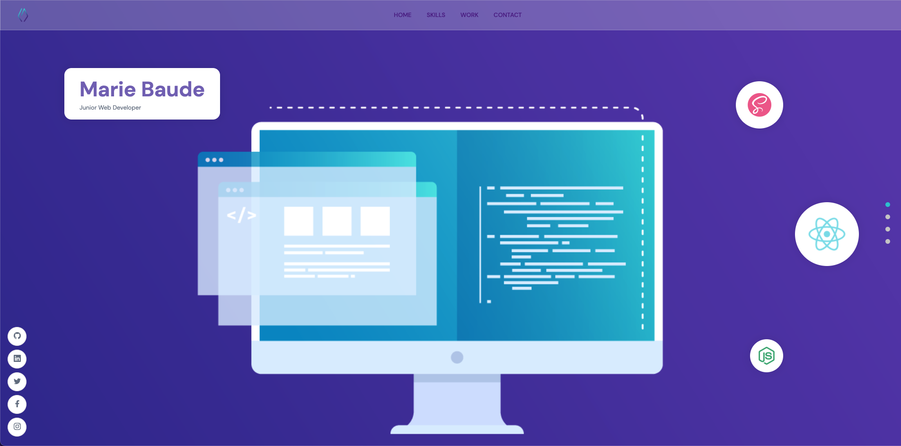

<h1 align="center">Welcome to Portfolio</h1>

  

  Sanity  

### ✨ [Demo](https://mariebaude.netlify.app/)

## Author

👤 **Marie Baude**
* Website: https://mariebaude.netlify.app/
* Twitter: [@MarieBaude95](https://twitter.com/MarieBaude95)
* Github: [@MarieBaude](https://github.com/MarieBaude)
* LinkedIn: [@baudemarie](https://linkedin.com/in/baudemarie\/)

## Show your support

Give a ⭐️ if this project helped you!

***
_This README was generated with ❤️ by [readme-md-generator](https://github.com/kefranabg/readme-md-generator)_